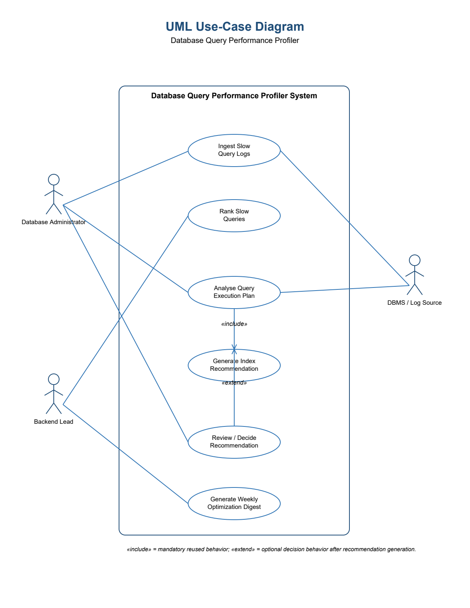

# SE Lab 1: Requirements Engineering & UML Use-Case Modelling

**Course:** Software Engineering Lab (UE24CS341A)  
**Institution:** PES University - Department of CSE  
**Student:** Nallamalli Kanaka Mani Sai Akhil  
**USN:** PES1UG24CS290  
**Problem Statement #44:** Database Query Performance Profiler  

---

## System Overview

The Database Query Performance Profiler is a database observability tool that ingests slow-query logs, parses PostgreSQL and MySQL execution plans, identifies possible missing indexes, and generates weekly performance-optimization digests.

**Primary Stakeholders:**

- Database Administrator
- Backend Lead

---

## Deliverables

- [Problem Statement](docs/Problem_Statement.pdf)
- [Requirements Specification](docs/Requirements_Specification.md)
- [Requirements Table](docs/Requirements_Table.docx)
- [UML Use-Case Diagram PDF](diagrams/UML_Use_Case_Diagram.pdf)
- [UML Diagram Source](diagrams/use_case_diagram.puml)
- [Use-Case Flow Specification](docs/Use_Case_Specification.md)
- [Use-Case Flow Document](docs/Use_Case_Flow.docx)
- [Use-Case Flow PDF](docs/Use_Case_Flow.pdf)

---

## UML Use-Case Diagram

[Download UML Use-Case Diagram PDF](diagrams/UML_Use_Case_Diagram.pdf)

### Actors

- Database Administrator
- Backend Lead
- DBMS / Log Source

### Core Use Cases

1. Ingest Slow Query Logs  
2. Rank Slow Queries  
3. Analyse Query Execution Plan  
4. Generate Index Recommendation  
5. Review / Decide Recommendation  
6. Generate Weekly Optimization Digest  

### UML Relationships

- `<<include>>`: Analyse Query Execution Plan includes Generate Index Recommendation.
- `<<extend>>`: Review / Decide Recommendation extends Generate Index Recommendation.

---

## Functional Requirements

| ID | Description | Priority |
|---|---|---|
| FR-001 | The system shall parse PostgreSQL and MySQL EXPLAIN plans, identify sequential scans on large tables, and recommend index column definitions. | High |
| FR-002 | The system shall ingest slow-query logs from configured PostgreSQL and MySQL sources. | High |
| FR-003 | The system shall rank slow-query fingerprints by cumulative execution time, average execution time, and execution count. | High |
| FR-004 | The system shall allow a Database Administrator to accept, dismiss, or annotate generated index recommendations. | Medium |
| FR-005 | The system shall generate a weekly optimization digest with query, plan-issue, and recommendation information. | Medium |

---

## Non-Functional Requirements

| ID | Type | Description | Priority |
|---|---|---|---|
| NFR-001 | Performance & Security | The system shall ingest up to 5,000 log records per minute without data loss or significant host database degradation. | High |
| NFR-002 | Security | The system shall encrypt stored query logs and enforce role-based access control for profiler data and actions. | High |

---

## Core Use-Case Flow

### UC-01: Analyse Query Execution Plan

**Primary Actor:** Database Administrator  

**Preconditions:**

- The Database Administrator is authenticated.
- A slow-query record and a valid PostgreSQL or MySQL EXPLAIN plan are available.

**Postconditions:**

- The analysis result, detected issues, and generated recommendation are saved in the query profile.

### Main Success Scenario

1. The Database Administrator opens a slow-query record.
2. The system displays normalized query details and the execution plan.
3. The Database Administrator selects **Analyse Plan**.
4. The system validates and parses the plan.
5. The system identifies sequential scans and checks filtered or join columns for missing indexes.
6. The system generates a proposed index definition and confidence level.
7. The system displays supporting evidence and the recommendation.
8. The Database Administrator accepts, dismisses, or annotates the recommendation.
9. The system records the decision, user, timestamp, and annotation.
10. The system confirms that the analysis and decision were saved.

### Alternate Flow A1: Unsupported or Invalid Plan

1. If the plan cannot be parsed or is unsupported, the system marks the analysis as failed and displays a validation error.
2. The system retains the original query and records an audit event.
3. The Database Administrator may upload a corrected plan or exit without creating a recommendation.
